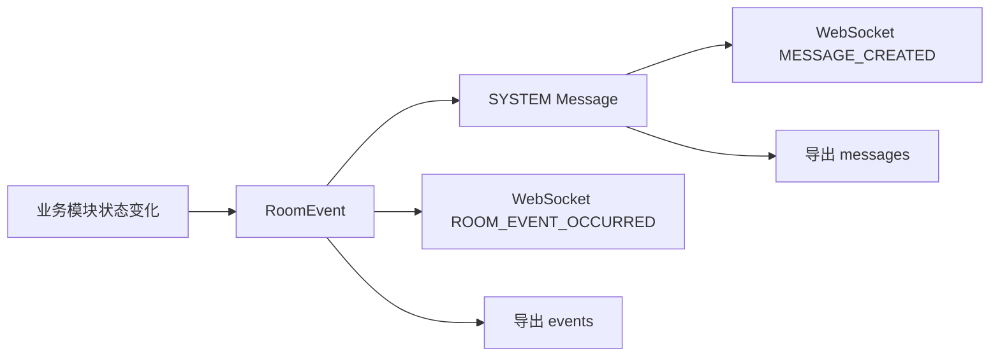

# Anonymous Temporary Community

> 匿名临时社区系统（MVP）API Contract

---

## 1. 文档范围

本文档基于：

- `doc/proposal.md`
- `doc/high-level-design.md`
- `doc/detailed-design.md`

定义匿名聊天室系统 MVP 的可执行级接口契约，覆盖：

- HTTP API 设计
- WebSocket 协议设计
- 事件与消息模型（`Message` / `RoomEvent`）

本文档仅描述现有设计中的 MVP 能力，不新增账号体系、好友、图片、文件、数据库、MQ、多实例等非目标能力。

---

## 2. 通用约定

### 2.1 时间与标识

- 所有时间字段使用 Unix epoch milliseconds。
- `userId`、`roomId`、`messageId`、`eventId` 均由服务端生成。
- 客户端本地保存 `userId`、`nickname`、`roomId`，但权威状态始终以 Redis 为准。

### 2.2 HTTP 响应 Envelope

成功：

```json
{
  "success": true,
  "data": {}
}
```

失败：

```json
{
  "success": false,
  "error": {
    "code": "ROOM_NOT_FOUND",
    "message": "room not found"
  }
}
```

### 2.3 WebSocket Envelope

client -> server：

```json
{
  "type": "SEND_PUBLIC_MESSAGE",
  "requestId": "client_req_001",
  "payload": {}
}
```

server -> client：

```json
{
  "type": "MESSAGE_CREATED",
  "requestId": "client_req_001",
  "payload": {}
}
```

`requestId` 由客户端生成，用于关联一次客户端请求；服务端主动推送时可为空。

### 2.4 错误码

| code | 含义 |
| --- | --- |
| `INVALID_REQUEST` | 请求结构或参数非法 |
| `USER_NOT_FOUND` | 用户会话不存在 |
| `USER_ALREADY_IN_ROOM` | 用户已处于其他房间 |
| `ROOM_NOT_FOUND` | 房间不存在 |
| `ROOM_EXPIRED` | 房间已过期 |
| `ROOM_FULL` | 房间人数已满 |
| `PASSWORD_REQUIRED` | 密码房未提供密码 |
| `PASSWORD_INVALID` | 房间密码错误 |
| `NICKNAME_DUPLICATED` | 同房间昵称重复 |
| `USER_BANNED` | 用户已被该房间 Ban |
| `USER_MUTED` | 用户处于禁言状态 |
| `MEMBER_NOT_FOUND` | 房间成员不存在 |
| `TARGET_NOT_FOUND` | 定向消息或治理目标不存在 |
| `FORBIDDEN` | 权限不足 |
| `CONFIG_LOCKED` | 后续房主不允许修改配置 |
| `RECONNECT_EXPIRED` | 重连窗口已过期 |
| `ROOM_CONTEXT_MISMATCH` | 用户本地房间上下文与服务端不一致 |
| `EXPORT_FAILED` | 导出失败 |
| `INTERNAL_ERROR` | 服务端内部错误 |

---

## 3. Redis Key 清单

本文档中的 HTTP API、WebSocket 消息和后台触发流程只能读写以下 Redis key。不得新增未在此表定义的运行态 key。

| Key | 类型 | 读写模块 |
| --- | --- | --- |
| `drrr:user:{userId}` | String(JSON) | 用户会话模块、房间模块、定时清理模块 |
| `drrr:room:{roomId}` | String(JSON) | 大厅模块、房间模块、聊天模块、房主管理模块、导出模块、定时清理模块 |
| `drrr:room:members:{roomId}` | ZSet | 大厅模块、房间模块、房主管理模块、聊天模块、治理模块、定时清理模块 |
| `drrr:room:messages:{roomId}` | List | 聊天模块、导出模块、定时清理模块 |
| `drrr:room:events:{roomId}` | List | 房间事件模块、聊天模块、导出模块、定时清理模块 |
| `drrr:room:active` | ZSet | 大厅模块、房间模块、聊天模块、定时清理模块 |
| `drrr:room:empty` | ZSet | 房间模块、定时清理模块 |
| `drrr:user:reconnecting` | ZSet | 用户会话模块、定时清理模块 |
| `drrr:room:mute:{roomId}` | ZSet | 治理模块、聊天模块、定时清理模块 |
| `drrr:room:mute:detail:{roomId}:{userId}` | String(JSON) | 治理模块、定时清理模块 |
| `drrr:room:ban:{roomId}` | Set | 房间模块、治理模块、定时清理模块 |
| `drrr:room:ban:detail:{roomId}:{userId}` | String(JSON) | 治理模块、定时清理模块 |
| `drrr:lobby:active-users` | ZSet | 大厅模块、用户会话模块 |

---

## 4. HTTP API 设计

### 4.1 创建匿名会话

path: `/api/sessions`

method: `POST`

业务模块：用户会话模块

request:

```json
{
  "nickname": "Alice"
}
```

response:

```json
{
  "userId": "u_xxx",
  "nickname": "Alice",
  "status": "ONLINE",
  "currentRoomId": null
}
```

error code:

- `INVALID_REQUEST`
- `INTERNAL_ERROR`

side effects:

- 写 `drrr:user:{userId}`：创建 `UserSession`。
- 写 `drrr:lobby:active-users`：以当前时间更新最近活跃用户索引。

---

### 4.2 获取大厅数据

path: `/api/lobby`

method: `GET`

业务模块：大厅模块

query:

| 参数 | 必填 | 说明 |
| --- | --- | --- |
| `sort` | 否 | `LAST_ACTIVE / MEMBER_COUNT / SURVIVAL_TIME`，默认 `LAST_ACTIVE` |

response:

```json
{
  "activeUsersLast5Minutes": 12,
  "rooms": [
    {
      "roomId": "r_xxx",
      "name": "深夜电台",
      "description": "匿名闲聊",
      "currentMembers": 5,
      "maxMembers": 10,
      "lastActiveAt": 1717300200000,
      "createdAt": 1717299000000
    }
  ]
}
```

error code:

- `INVALID_REQUEST`
- `INTERNAL_ERROR`

side effects:

- 读 `drrr:lobby:active-users`：统计最近 5 分钟活跃人数。
- 读 `drrr:room:active`：获取候选房间。
- 读 `drrr:room:{roomId}`：组装房间卡片。
- 读 `drrr:room:members:{roomId}`：统计当前成员数。
- 无写入。

---

### 4.3 创建房间

path: `/api/rooms`

method: `POST`

业务模块：房间模块、房主管理模块、用户会话模块

request:

```json
{
  "userId": "u_xxx",
  "name": "深夜电台",
  "description": "匿名闲聊",
  "password": "optional_plain_text",
  "maxMembers": 10,
  "userListVisible": true,
  "historyStrategy": {
    "type": "COUNT",
    "value": 50
  },
  "allowOwnerConfigChange": true
}
```

response:

```json
{
  "room": {
    "roomId": "r_xxx",
    "name": "深夜电台",
    "description": "匿名闲聊",
    "maxMembers": 10,
    "ownerUserId": "u_xxx",
    "status": "ACTIVE",
    "userListVisible": true,
    "historyStrategy": {
      "type": "COUNT",
      "value": 50
    },
    "allowOwnerConfigChange": true,
    "createdAt": 1717299000000,
    "lastActiveAt": 1717299000000,
    "emptySince": null
  },
  "member": {
    "roomId": "r_xxx",
    "userId": "u_xxx",
    "nickname": "Alice",
    "memberStatus": "ONLINE",
    "joinedAt": 1717299000000,
    "isOwner": true
  }
}
```

error code:

- `INVALID_REQUEST`
- `USER_NOT_FOUND`
- `USER_ALREADY_IN_ROOM`
- `INTERNAL_ERROR`

side effects:

- 读 `drrr:user:{userId}`：校验用户存在且未在其他房间。
- 写 `drrr:room:{roomId}`：创建房间主数据，密码只写哈希。
- 写 `drrr:room:members:{roomId}`：写入创建者成员关系，score=`joinedAt`。
- 写 `drrr:user:{userId}`：更新 `currentRoomId`、`updatedAt`。
- 写 `drrr:room:active`：score=`lastActiveAt`。
- 不写 `drrr:room:events:{roomId}`：详细设计默认创建房间不额外生成系统消息。

---

### 4.4 加入房间

path: `/api/rooms/{roomId}/join`

method: `POST`

业务模块：房间模块、治理模块、聊天模块、房间事件模块

request:

```json
{
  "userId": "u_xxx",
  "password": "optional_plain_text"
}
```

response:

```json
{
  "room": {
    "roomId": "r_xxx",
    "name": "深夜电台",
    "description": "匿名闲聊",
    "maxMembers": 10,
    "ownerUserId": "u_owner",
    "status": "ACTIVE",
    "userListVisible": true,
    "historyStrategy": {
      "type": "COUNT",
      "value": 50
    },
    "allowOwnerConfigChange": true,
    "createdAt": 1717299000000,
    "lastActiveAt": 1717300200000,
    "emptySince": null
  },
  "member": {
    "roomId": "r_xxx",
    "userId": "u_xxx",
    "nickname": "Alice",
    "memberStatus": "ONLINE",
    "joinedAt": 1717300200000,
    "isOwner": false
  },
  "members": [],
  "historyMessages": []
}
```

error code:

- `INVALID_REQUEST`
- `USER_NOT_FOUND`
- `USER_ALREADY_IN_ROOM`
- `ROOM_NOT_FOUND`
- `ROOM_EXPIRED`
- `USER_BANNED`
- `PASSWORD_REQUIRED`
- `PASSWORD_INVALID`
- `ROOM_FULL`
- `NICKNAME_DUPLICATED`
- `INTERNAL_ERROR`

side effects:

- 读 `drrr:user:{userId}`：校验会话与昵称。
- 读/写 `drrr:room:{roomId}`：校验房间状态、密码、配置；更新 `lastActiveAt`，必要时从 `EMPTY` 恢复为 `ACTIVE` 并清空 `emptySince`。
- 读/写 `drrr:room:members:{roomId}`：校验人数、昵称重复，写入成员关系。
- 读 `drrr:room:ban:{roomId}`：校验 Ban。
- 写 `drrr:user:{userId}`：更新 `currentRoomId` 与状态。
- 写 `drrr:room:active`：更新活跃索引。
- 写/删 `drrr:room:empty`：若房间从 `EMPTY` 恢复，删除空房索引。
- 写 `drrr:room:events:{roomId}`：追加 `USER_JOIN`。
- 写 `drrr:room:messages:{roomId}`：由 `USER_JOIN` 事件驱动生成 `SYSTEM` 消息。
- 读 `drrr:room:messages:{roomId}`：按历史策略返回历史消息。

---

### 4.5 主动离开房间

path: `/api/rooms/{roomId}/leave`

method: `POST`

业务模块：房间模块、房主管理模块、房间事件模块、聊天模块

request:

```json
{
  "userId": "u_xxx"
}
```

response:

```json
{
  "left": true,
  "ownerTransferred": true,
  "newOwnerUserId": "u_new_owner",
  "roomStatus": "ACTIVE"
}
```

error code:

- `INVALID_REQUEST`
- `USER_NOT_FOUND`
- `ROOM_NOT_FOUND`
- `MEMBER_NOT_FOUND`
- `INTERNAL_ERROR`

side effects:

- 读/写 `drrr:user:{userId}`：清空 `currentRoomId`，保持大厅态 `ONLINE`。
- 读/写 `drrr:room:{roomId}`：必要时更新 `ownerUserId`、`status`、`emptySince`、`lastActiveAt`。
- 读/写 `drrr:room:members:{roomId}`：删除离房成员，按 `joinedAt` 选择继承人。
- 写 `drrr:room:events:{roomId}`：追加 `USER_LEAVE`；若房主转移追加 `OWNER_TRANSFER`；若无人追加 `ROOM_EMPTY`。
- 写 `drrr:room:messages:{roomId}`：由上述事件驱动生成 `SYSTEM` 消息。
- 写/删 `drrr:room:active`：房间仍有成员时更新；进入 `EMPTY` 时可保留房间列表展示但状态为 `EMPTY`。
- 写 `drrr:room:empty`：房间无人时写入，score=`emptySince`。

---

### 4.6 修改房间信息与配置

path: `/api/rooms/{roomId}`

method: `PATCH`

业务模块：房间模块、房主管理模块、聊天模块

request:

```json
{
  "operatorUserId": "u_owner",
  "name": "新的房间名",
  "description": "新的简介",
  "userListVisible": true,
  "historyStrategy": {
    "type": "COUNT",
    "value": 20
  },
  "allowOwnerConfigChange": true
}
```

response:

```json
{
  "room": {
    "roomId": "r_xxx",
    "name": "新的房间名",
    "description": "新的简介",
    "ownerUserId": "u_owner",
    "status": "ACTIVE",
    "userListVisible": true,
    "historyStrategy": {
      "type": "COUNT",
      "value": 20
    },
    "allowOwnerConfigChange": true,
    "lastActiveAt": 1717300200000
  }
}
```

error code:

- `INVALID_REQUEST`
- `ROOM_NOT_FOUND`
- `USER_NOT_FOUND`
- `FORBIDDEN`
- `CONFIG_LOCKED`
- `INTERNAL_ERROR`

side effects:

- 读 `drrr:user:{operatorUserId}`：校验操作者存在。
- 读/写 `drrr:room:{roomId}`：校验房主权限并更新房间字段。
- 读 `drrr:room:members:{roomId}`：校验操作者是当前成员。
- 写 `drrr:room:active`：更新活跃索引。
- 写 `drrr:room:messages:{roomId}`：生成 `SYSTEM` 消息说明房间配置变更。
- 不写 `drrr:room:events:{roomId}`：当前 `RoomEvent` 类型列表未包含房间配置变更事件，系统消息可由房间模块直接触发聊天模块生成。

---

### 4.7 禁言成员

path: `/api/rooms/{roomId}/members/{targetUserId}/mute`

method: `POST`

业务模块：治理模块、房间事件模块、聊天模块

request:

```json
{
  "operatorUserId": "u_owner",
  "durationMinutes": 30,
  "reason": "owner_action"
}
```

response:

```json
{
  "muted": true,
  "record": {
    "roomId": "r_xxx",
    "userId": "u_target",
    "mutedBy": "u_owner",
    "startAt": 1717300200000,
    "endAt": 1717302000000,
    "reason": "owner_action"
  }
}
```

error code:

- `INVALID_REQUEST`
- `ROOM_NOT_FOUND`
- `USER_NOT_FOUND`
- `MEMBER_NOT_FOUND`
- `FORBIDDEN`
- `INTERNAL_ERROR`

side effects:

- 读 `drrr:room:{roomId}`：校验当前房主。
- 读 `drrr:room:members:{roomId}`：校验操作者与目标均为成员。
- 写 `drrr:room:mute:{roomId}`：score=`endAt`。
- 写 `drrr:room:mute:detail:{roomId}:{targetUserId}`：写入 `MuteRecord`。
- 写 `drrr:room:events:{roomId}`：追加 `USER_MUTED`。
- 写 `drrr:room:messages:{roomId}`：由 `USER_MUTED` 事件驱动生成 `SYSTEM` 消息。

---

### 4.8 踢出成员

path: `/api/rooms/{roomId}/members/{targetUserId}/kick`

method: `POST`

业务模块：治理模块、房间模块、房间事件模块、聊天模块

request:

```json
{
  "operatorUserId": "u_owner",
  "reason": "owner_action"
}
```

response:

```json
{
  "kicked": true,
  "targetUserId": "u_target",
  "roomStatus": "ACTIVE",
  "ownerTransferred": false,
  "newOwnerUserId": null
}
```

error code:

- `INVALID_REQUEST`
- `ROOM_NOT_FOUND`
- `USER_NOT_FOUND`
- `MEMBER_NOT_FOUND`
- `FORBIDDEN`
- `INTERNAL_ERROR`

side effects:

- 读 `drrr:room:{roomId}`：校验当前房主。
- 读/写 `drrr:room:members:{roomId}`：删除目标成员，必要时触发继承。
- 读/写 `drrr:user:{targetUserId}`：清空目标 `currentRoomId`，阻止旧 `roomId` 自动重连。
- 删 `drrr:user:reconnecting` 中目标用户记录。
- 写 `drrr:room:events:{roomId}`：追加 `USER_KICKED`；必要时追加 `OWNER_TRANSFER` 或 `ROOM_EMPTY`。
- 写 `drrr:room:messages:{roomId}`：由事件驱动生成 `SYSTEM` 消息。
- 写 `drrr:room:empty`：若踢出后无人，写入空房索引。

---

### 4.9 Ban 成员

path: `/api/rooms/{roomId}/members/{targetUserId}/ban`

method: `POST`

业务模块：治理模块、房间模块、房间事件模块、聊天模块

request:

```json
{
  "operatorUserId": "u_owner",
  "reason": "owner_action"
}
```

response:

```json
{
  "banned": true,
  "targetUserId": "u_target",
  "kicked": true
}
```

error code:

- `INVALID_REQUEST`
- `ROOM_NOT_FOUND`
- `USER_NOT_FOUND`
- `FORBIDDEN`
- `INTERNAL_ERROR`

side effects:

- 读 `drrr:room:{roomId}`：校验当前房主。
- 读 `drrr:room:members:{roomId}`：校验操作者成员身份；目标若在房间内则执行离房。
- 写 `drrr:room:ban:{roomId}`：加入目标 `userId`。
- 写 `drrr:room:ban:detail:{roomId}:{targetUserId}`：写入 `BanRecord`。
- 若目标在房间内，写 `drrr:user:{targetUserId}`：清空目标 `currentRoomId`。
- 若目标在房间内，写 `drrr:room:members:{roomId}`：删除目标成员。
- 删 `drrr:user:reconnecting` 中目标用户记录。
- 写 `drrr:room:events:{roomId}`：追加 `USER_BANNED`；若执行离房导致房主继承或空房，追加对应事件。
- 写 `drrr:room:messages:{roomId}`：由事件驱动生成 `SYSTEM` 消息。

---

### 4.10 导出聊天记录

path: `/api/rooms/{roomId}/export`

method: `GET`

业务模块：导出模块、聊天模块、房间事件模块

query:

| 参数 | 必填 | 说明 |
| --- | --- | --- |
| `operatorUserId` | 是 | 当前房主 `userId` |

response:

```json
{
  "fileName": "room_r_xxx.json",
  "content": {
    "roomId": "r_xxx",
    "roomName": "深夜电台",
    "exportedAt": 1717300200000,
    "messages": [],
    "events": []
  }
}
```

error code:

- `INVALID_REQUEST`
- `ROOM_NOT_FOUND`
- `USER_NOT_FOUND`
- `FORBIDDEN`
- `EXPORT_FAILED`
- `INTERNAL_ERROR`

side effects:

- 读 `drrr:room:{roomId}`：读取房间信息并校验操作者是房主。
- 读 `drrr:room:messages:{roomId}`：读取当前 Redis 中仍保留的消息。
- 读 `drrr:room:events:{roomId}`：读取当前房间轻量事件日志。
- 无写入。

---

## 5. WebSocket 协议设计

### 5.1 连接地址

path: `/ws/rooms/{roomId}`

连接参数：

| 参数 | 必填 | 说明 |
| --- | --- | --- |
| `userId` | 是 | 匿名用户标识 |

连接建立时，服务端必须校验：

- `drrr:user:{userId}` 存在。
- `UserSession.currentRoomId` 与 `{roomId}` 一致。
- `drrr:room:{roomId}` 存在且未过期。
- `drrr:room:members:{roomId}` 中存在该用户。

连接失败时直接拒绝 WebSocket 连接；连接建立成功后，用户处于房间实时通信上下文。

### 5.2 client -> server message types

#### 5.2.1 `SEND_PUBLIC_MESSAGE`

业务模块：聊天模块、治理模块

type: `SEND_PUBLIC_MESSAGE`

payload schema:

```json
{
  "roomId": "r_xxx",
  "senderUserId": "u_xxx",
  "content": "你好"
}
```

触发时机：

- 用户在房间内发送公共消息。

可见范围：

- 发送成功后，服务端通过 `MESSAGE_CREATED` 推送给房间内全部在线成员。

Redis 读写：

- 读 `drrr:room:{roomId}`：获取房间配置与历史策略。
- 读 `drrr:room:members:{roomId}`：校验发送者成员身份。
- 读 `drrr:room:mute:{roomId}`：校验禁言。
- 读/删 `drrr:room:mute:detail:{roomId}:{senderUserId}`：禁言过期时清理详情。
- 写 `drrr:room:messages:{roomId}`：追加 `PUBLIC` 消息并按历史策略裁剪。
- 写 `drrr:room:{roomId}`：刷新 `lastActiveAt`。
- 写 `drrr:room:active`：刷新房间活跃索引。

---

#### 5.2.2 `SEND_DIRECT_MESSAGE`

业务模块：聊天模块、治理模块、用户会话模块

type: `SEND_DIRECT_MESSAGE`

payload schema:

```json
{
  "roomId": "r_xxx",
  "senderUserId": "u_sender",
  "targetUserId": "u_target",
  "content": "你好"
}
```

触发时机：

- 用户在房间内向指定成员发送定向消息。

可见范围：

- 发送成功后，服务端通过 `MESSAGE_CREATED` 仅推送给发送者与接收者。

Redis 读写：

- 读 `drrr:room:{roomId}`：获取房间配置与历史策略。
- 读 `drrr:room:members:{roomId}`：校验发送者与接收者都属于房间。
- 读 `drrr:room:mute:{roomId}`：校验发送者禁言。
- 读/删 `drrr:room:mute:detail:{roomId}:{senderUserId}`：禁言过期时清理详情。
- 写 `drrr:room:messages:{roomId}`：追加 `DIRECT` 消息并按历史策略裁剪。
- 写 `drrr:room:{roomId}`：刷新 `lastActiveAt`。
- 写 `drrr:room:active`：刷新房间活跃索引。

---

#### 5.2.3 `RECONNECT_ROOM`

业务模块：用户会话模块、房间模块、房间事件模块、聊天模块

type: `RECONNECT_ROOM`

payload schema:

```json
{
  "roomId": "r_xxx",
  "userId": "u_xxx"
}
```

触发时机：

- WebSocket 断开后，客户端在 5 分钟重连窗口内重新建立连接并请求恢复房间状态。

可见范围：

- 恢复成功后，服务端通过 `ROOM_STATE_SYNC` 推送给重连用户。
- 同时通过 `MESSAGE_CREATED` 推送由 `USER_RECONNECTED` 事件驱动生成的系统消息给房间内全部在线成员。

Redis 读写：

- 读/写 `drrr:user:{userId}`：校验 `currentRoomId`、状态和断线时间，恢复为 `ONLINE`。
- 读/写 `drrr:room:members:{roomId}`：恢复成员状态为 `ONLINE`。
- 读 `drrr:room:{roomId}`：校验房间存在且未过期。
- 删 `drrr:user:reconnecting`：移除重连索引。
- 写 `drrr:room:events:{roomId}`：追加 `USER_RECONNECTED`。
- 写 `drrr:room:messages:{roomId}`：由 `USER_RECONNECTED` 事件驱动生成 `SYSTEM` 消息。

---

### 5.3 server -> client message types

#### 5.3.1 `MESSAGE_CREATED`

业务模块：聊天模块

type: `MESSAGE_CREATED`

payload schema:

```json
{
  "message": {
    "messageId": "m_xxx",
    "roomId": "r_xxx",
    "type": "PUBLIC",
    "senderUserId": "u_a",
    "senderNickname": "Alice",
    "targetUserId": null,
    "targetNickname": null,
    "content": "你好",
    "visibleTo": [],
    "sourceEventId": null,
    "sourceEventType": null,
    "sentAt": 1717300200000
  }
}
```

触发时机：

- 公共消息发送成功。
- 定向消息发送成功。
- 业务事件生成系统消息成功。

可见范围：

- `PUBLIC`：房间内全部在线成员。
- `DIRECT`：发送者与接收者。
- `SYSTEM`：房间内全部在线成员；若事件为踢出或 Ban，目标用户也必须收到一次治理结果通知。

Redis 来源：

- `drrr:room:messages:{roomId}`

---

#### 5.3.2 `ROOM_EVENT_OCCURRED`

业务模块：房间事件模块、房间模块、用户会话模块、房主管理模块、治理模块、定时清理模块

type: `ROOM_EVENT_OCCURRED`

payload schema:

```json
{
  "event": {
    "eventId": "e_xxx",
    "roomId": "r_xxx",
    "type": "OWNER_TRANSFER",
    "operatorUserId": "u_old_owner",
    "targetUserId": "u_new_owner",
    "payload": {
      "fromUserId": "u_old_owner",
      "toUserId": "u_new_owner"
    },
    "occurredAt": 1717300200000
  }
}
```

触发时机：

- 房间事件模块成功记录 `RoomEvent` 后推送。

可见范围：

- `USER_JOIN`：房间内全部在线成员。
- `USER_LEAVE`：房间内全部在线成员。
- `USER_RECONNECTING`：房间内仍在线成员。
- `USER_RECONNECTED`：房间内全部在线成员。
- `OWNER_TRANSFER`：房间内全部在线成员。
- `USER_MUTED`：房间内全部在线成员。
- `USER_KICKED`：房间内全部在线成员，以及被踢出用户本人。
- `USER_BANNED`：房间内全部在线成员，以及被 Ban 用户本人。
- `ROOM_EMPTY`：无需向普通房间成员推送；若仍存在连接，仅推送给相关连接。
- `ROOM_EXPIRED`：若仍存在连接，推送给相关连接后关闭房间连接。

Redis 来源：

- `drrr:room:events:{roomId}`

---

#### 5.3.3 `ROOM_STATE_SYNC`

业务模块：房间模块、用户会话模块、聊天模块

type: `ROOM_STATE_SYNC`

payload schema:

```json
{
  "room": {},
  "member": {},
  "members": [],
  "historyMessages": []
}
```

触发时机：

- WebSocket 首次连接成功后。
- `RECONNECT_ROOM` 恢复成功后。

可见范围：

- 仅当前连接用户。

Redis 来源：

- 读 `drrr:room:{roomId}`。
- 读 `drrr:room:members:{roomId}`。
- 读 `drrr:room:messages:{roomId}`，并按当前用户可见范围过滤。

---

#### 5.3.4 `ROOM_REMOVED`

业务模块：定时清理模块、房间模块

type: `ROOM_REMOVED`

payload schema:

```json
{
  "roomId": "r_xxx",
  "reason": "EXPIRED"
}
```

触发时机：

- 房间无人持续 24 小时，定时清理模块执行过期销毁。

可见范围：

- 若房间过期时仍存在残留连接，推送给相关连接后关闭连接。

Redis 读写：

- 读/写 `drrr:room:{roomId}`：标记过期流程。
- 写 `drrr:room:events:{roomId}`：追加 `ROOM_EXPIRED`。
- 删 `drrr:room:{roomId}`。
- 删 `drrr:room:members:{roomId}`。
- 删 `drrr:room:messages:{roomId}`。
- 删 `drrr:room:events:{roomId}`。
- 删 `drrr:room:mute:{roomId}`。
- 删 `drrr:room:ban:{roomId}`。
- 删 `drrr:room:active` 中该房间。
- 删 `drrr:room:empty` 中该房间。
- 删匹配该房间的 `drrr:room:mute:detail:{roomId}:{userId}` 与 `drrr:room:ban:detail:{roomId}:{userId}`。

---

#### 5.3.5 `ERROR`

业务模块：WebSocket 通信层、对应业务模块

type: `ERROR`

payload schema:

```json
{
  "code": "USER_MUTED",
  "message": "user is muted"
}
```

触发时机：

- client -> server 消息校验失败。
- 业务规则拒绝。
- WebSocket 请求处理失败。

可见范围：

- 仅发送该请求的连接用户。

Redis 来源：

- 取决于失败的业务命令，不单独读写 Redis。

---

### 5.4 WebSocket 断开服务端触发流程

WebSocket 断开不是 client message type，但属于协议必须处理的连接事件。

业务模块：WebSocket 通信层、用户会话模块、房间事件模块、聊天模块

触发时机：

- 服务端感知用户房间连接断开。

可见范围：

- 由 `USER_RECONNECTING` 事件驱动生成的 `SYSTEM` 消息对房间内仍在线成员可见。

Redis 读写：

- 读/写 `drrr:user:{userId}`：设置 `status=RECONNECTING`、`connected=false`、`lastDisconnectedAt`。
- 读/写 `drrr:room:members:{roomId}`：设置成员状态为 `RECONNECTING`。
- 写 `drrr:user:reconnecting`：score=`lastDisconnectedAt`。
- 写 `drrr:room:events:{roomId}`：追加 `USER_RECONNECTING`。
- 写 `drrr:room:messages:{roomId}`：由 `USER_RECONNECTING` 事件驱动生成 `SYSTEM` 消息。

---

## 6. 事件与消息模型

### 6.1 Message

```json
{
  "messageId": "m_xxx",
  "roomId": "r_xxx",
  "type": "PUBLIC",
  "senderUserId": "u_a",
  "senderNickname": "Alice",
  "targetUserId": null,
  "targetNickname": null,
  "content": "你好",
  "visibleTo": [],
  "sourceEventId": null,
  "sourceEventType": null,
  "sentAt": 1717300200000
}
```

Message 类型列表：

| type | 来源 | 可见范围 | Redis key |
| --- | --- | --- | --- |
| `PUBLIC` | `SEND_PUBLIC_MESSAGE` | 房间内全部在线成员 | `drrr:room:messages:{roomId}` |
| `DIRECT` | `SEND_DIRECT_MESSAGE` | 发送者与接收者 | `drrr:room:messages:{roomId}` |
| `SYSTEM` | `RoomEvent` 或房间配置变更命令驱动 | 房间内全部在线成员，治理目标也必须收到结果通知 | `drrr:room:messages:{roomId}` |

`SYSTEM` 消息来源约束：

- `SYSTEM` 消息不是用户直接发送的消息。
- 大部分 `SYSTEM` 消息由 `RoomEvent` 驱动生成，并通过 `sourceEventId`、`sourceEventType` 回溯来源事件。
- 房间配置变更在当前 `RoomEvent` 类型列表中没有独立事件类型，因此由房间模块直接触发聊天模块生成 `SYSTEM` 消息，`sourceEventId=null`，`sourceEventType=null`。

### 6.2 RoomEvent

```json
{
  "eventId": "e_xxx",
  "roomId": "r_xxx",
  "type": "OWNER_TRANSFER",
  "operatorUserId": "u_old_owner",
  "targetUserId": "u_new_owner",
  "payload": {
    "fromUserId": "u_old_owner",
    "toUserId": "u_new_owner"
  },
  "occurredAt": 1717300200000
}
```

RoomEvent 类型列表：

| type | 产生模块 | payload 约束 | 派生 SYSTEM_MESSAGE |
| --- | --- | --- | --- |
| `USER_JOIN` | 房间模块 | 可包含 `nickname` | 是 |
| `USER_LEAVE` | 房间模块 | 可包含 `nickname`、`reason` | 是 |
| `USER_RECONNECTING` | 用户会话模块 | 可包含 `nickname`、`lastDisconnectedAt` | 是 |
| `USER_RECONNECTED` | 用户会话模块 | 可包含 `nickname`、`reconnectedAt` | 是 |
| `OWNER_TRANSFER` | 房主管理模块 | 包含 `fromUserId`、`toUserId` | 是 |
| `USER_MUTED` | 治理模块 | 包含 `durationMinutes`、`endAt`、`reason` | 是 |
| `USER_KICKED` | 治理模块 | 可包含 `reason` | 是 |
| `USER_BANNED` | 治理模块 | 可包含 `reason`、`bannedAt` | 是 |
| `ROOM_EMPTY` | 房间模块 | 包含 `emptySince` | 可生成，仅在存在可见连接时推送 |
| `ROOM_EXPIRED` | 定时清理模块 | 包含 `expiredAt` | 可生成，仅在存在残留连接时推送 |

payload 统一约束：

- `payload` 只保存事件特有补充字段。
- `payload` 不重复保存 `eventId`、`roomId`、`type`、`operatorUserId`、`targetUserId`、`occurredAt` 等公共字段。
- `RoomEvent` 只记录房间运行态事实，不直接替代 `Message`。

### 6.3 Message 与 RoomEvent 的关系



一致性规则：

1. 用户主动聊天只生成 `Message`，不生成 `RoomEvent`。
2. 房间状态变化、成员状态变化、治理行为、生命周期变化必须先生成 `RoomEvent`。
3. 由事件展示给用户的系统提示必须生成 `Message.type=SYSTEM`。
4. 导出时 `messages` 来自 `drrr:room:messages:{roomId}`，`events` 来自 `drrr:room:events:{roomId}`。
5. 房间销毁时，`Message` 与 `RoomEvent` 均同步删除。

---

## 7. 一致性强约束

### 7.1 API 与 Redis key 映射约束

- 任一 HTTP API 必须在本文档的 side effects 中列出完整 Redis key 读写。
- 任一 WebSocket message type 必须在本文档中列出 Redis 读写或 Redis 来源。
- 实现时不得引入本文档 `Redis Key 清单` 之外的新 key。
- 若某业务流程不需要写 Redis，必须明确标注无写入。

### 7.2 WebSocket 与业务模块追溯约束

| WebSocket type | 业务模块 |
| --- | --- |
| `SEND_PUBLIC_MESSAGE` | 聊天模块、治理模块 |
| `SEND_DIRECT_MESSAGE` | 聊天模块、治理模块、用户会话模块 |
| `RECONNECT_ROOM` | 用户会话模块、房间模块、房间事件模块、聊天模块 |
| `MESSAGE_CREATED` | 聊天模块 |
| `ROOM_EVENT_OCCURRED` | 房间事件模块及事件产生模块 |
| `ROOM_STATE_SYNC` | 房间模块、用户会话模块、聊天模块 |
| `ROOM_REMOVED` | 定时清理模块、房间模块 |
| `ERROR` | WebSocket 通信层及对应业务模块 |

### 7.3 系统消息约束

- `SYSTEM` 消息必须说明来源。
- 由 `RoomEvent` 产生的系统消息必须保存 `sourceEventId` 与 `sourceEventType`。
- 当前唯一允许 `sourceEventId=null` 的 `SYSTEM` 消息是房间配置变更消息，因为现有 `RoomEvent` 类型列表没有配置变更事件。
- 不允许客户端通过 WebSocket 或 HTTP 直接创建 `SYSTEM` 消息。

### 7.4 生命周期删除约束

房间进入 `EXPIRED` 并执行销毁时，必须删除：

- `drrr:room:{roomId}`
- `drrr:room:members:{roomId}`
- `drrr:room:messages:{roomId}`
- `drrr:room:events:{roomId}`
- `drrr:room:mute:{roomId}`
- `drrr:room:ban:{roomId}`
- `drrr:room:mute:detail:{roomId}:{userId}`
- `drrr:room:ban:detail:{roomId}:{userId}`

同时必须从以下索引移除该房间：

- `drrr:room:active`
- `drrr:room:empty`

### 7.5 MVP 范围约束

- 不提供注册、登录、邮箱、手机号接口。
- 不提供好友、关注、用户主页接口。
- 不提供图片、文件、语音、视频消息类型。
- 不提供永久消息查询接口。
- 不提供 MQ、多实例、数据库相关契约。

