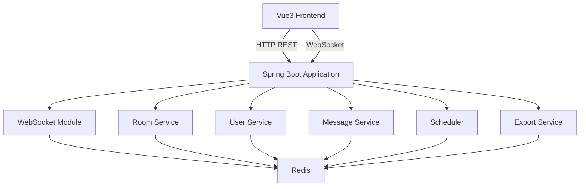
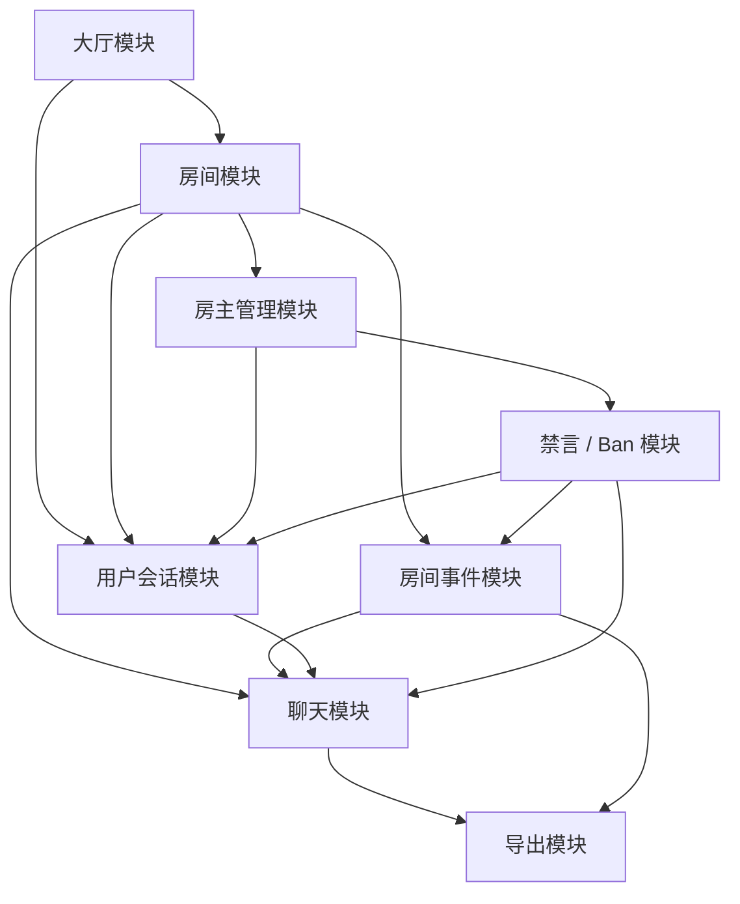
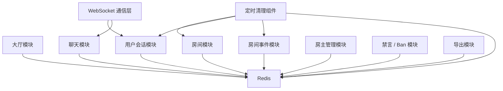
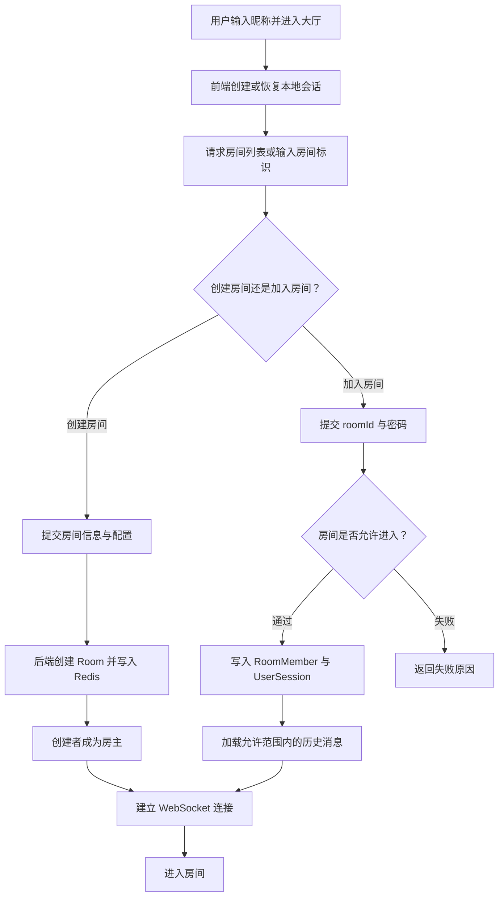
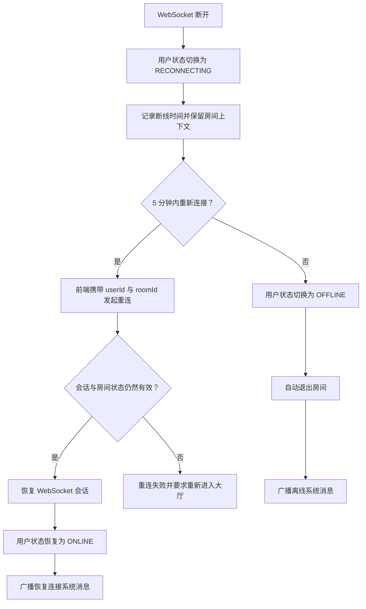
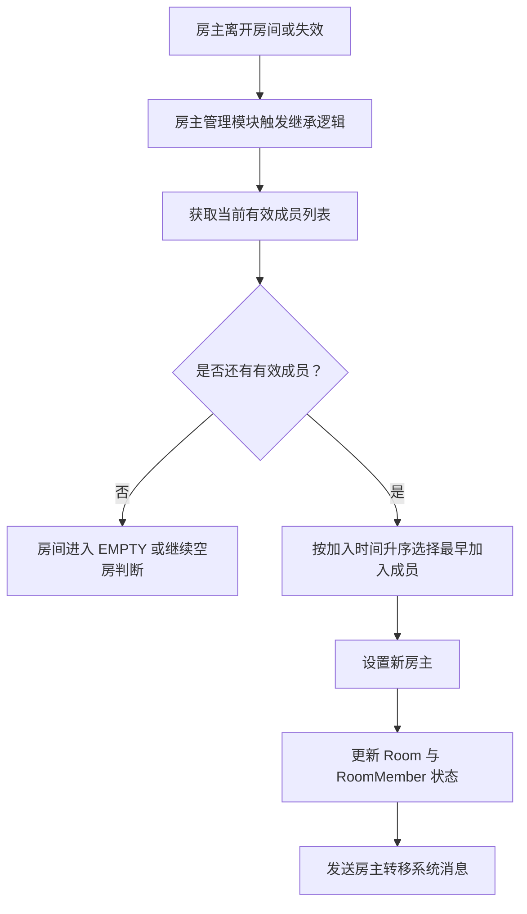
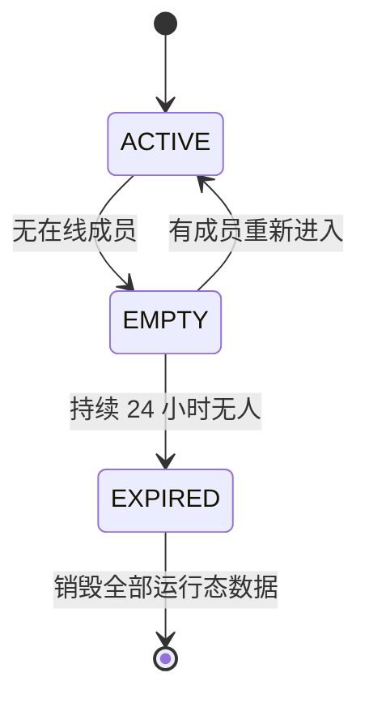

# Anonymous Temporary Community

> 匿名临时社区系统（MVP）概要设计文档

---

## 1. 文档目的

本文档基于需求文档 [proposal.md](D:\work\project\myproject\drrr\doc\proposal.md)，给出匿名临时社区系统 MVP 的概要设计，重点说明：

- 系统整体架构
- 核心模块划分
- 模块之间的关系
- 核心实体设计
- 核心接口设计
- 关键业务流程

本文档为概要级设计，不展开详细字段校验规则、完整 API 协议、数据库设计或部署编排细节。

---

## 2. 设计范围与约束

### 2.1 技术栈

- Java 21
- Spring Boot 3
- Spring WebSocket
- Redis
- Vue 3

### 2.2 当前范围

本阶段仅设计单体 MVP 架构，包含：

- 前端应用
- 后端服务
- WebSocket 通信层
- Redis 状态存储
- 定时清理组件

### 2.3 明确不引入

- MQ
- 数据库
- 微服务拆分
- 多实例部署

这意味着当前系统以单服务进程为中心，Redis 既承担运行态存储，也承担部分临时消息与状态管理职责。

---

## 3. 设计目标

系统围绕“匿名房间、临时社区、实时通信”展开，概要设计目标如下：

1. 支持匿名用户快速进入大厅并加入房间。
2. 支持房间内实时消息通信，包括公共消息与定向消息。
3. 支持断线重连与会话恢复，保证临时会话连续性。
4. 支持房主继承、禁言、踢出、Ban 等房间治理能力。
5. 支持房间无人后休眠并最终过期销毁。
6. 所有运行状态以 Redis 为核心存储，不保留永久业务数据。

---

## 4. 系统总体架构

### 4.1 架构说明

系统采用前后端分离、单体后端 + Redis 的结构：

- Vue3 前端负责页面展示、用户操作、WebSocket 连接维护、本地会话恢复。
- Spring Boot 后端负责 HTTP 接口、WebSocket 会话管理、业务规则执行、房间生命周期管理。
- Redis 负责房间状态、成员状态、消息缓存、房间事件日志、禁言/Ban 信息、生命周期标记等运行态数据。
- 定时清理组件负责扫描房间空闲状态、用户重连超时状态，并执行清理与销毁。

### 4.2 系统架构图

---

## 5. 系统组件设计

本系统先按系统组件划分，再按业务模块展开。

### 5.1 前端

职责：

- 用户输入昵称并进入大厅
- 展示大厅房间列表与活跃信息
- 创建房间、加入房间、离开房间
- 建立 WebSocket 连接并接收实时事件
- 发送公共消息与定向消息
- 在浏览器本地保存 `userId`、`nickname`、`roomId`
- 在连接异常时触发断线重连流程

前端是用户交互入口，不保存权威状态。权威状态以服务端与 Redis 为准。

### 5.2 后端服务

职责：

- 提供大厅、房间、会话、治理、导出等 HTTP 接口
- 执行业务规则校验
- 协调 WebSocket 层与 Redis 状态存储
- 处理房主继承、房间配置变更、用户状态变更

后端服务是系统业务中枢。

### 5.3 WebSocket 通信层

职责：

- 建立房间内实时通信通道
- 维护连接与会话映射关系
- 分发公共消息、定向消息、系统事件消息
- 感知连接断开并驱动用户进入 `RECONNECTING`

WebSocket 层负责实时性，不负责长期持久化。

### 5.4 Redis 状态存储

职责：

- 存储房间信息
- 存储用户会话与房间成员状态
- 存储房间历史消息缓存
- 存储房间轻量事件日志
- 存储禁言记录与 Ban 记录
- 存储房间生命周期状态
- 存储待重连窗口期状态

Redis 是本系统唯一运行态权威存储。

### 5.5 定时清理组件

职责：

- 扫描 `RECONNECTING` 超时用户
- 扫描空房间并记录/推进生命周期
- 销毁超过 24 小时无人房间
- 清理过期消息缓存与临时状态

该组件保证“临时社区”的生命周期闭环。

---

## 6. 业务模块设计

### 6.1 大厅模块

职责：

- 返回最近 5 分钟活跃人数
- 返回房间列表
- 支持按最近活跃、人数、房间存活时间排序
- 对密码房间提供进入前校验入口

依赖关系：

- 依赖房间模块获取房间摘要
- 依赖用户会话模块统计活跃用户

### 6.2 房间模块

职责：

- 创建房间
- 修改房间基础信息
- 控制用户加入/离开
- 校验房间密码与人数上限
- 管理房间配置
- 管理房间生命周期状态

依赖关系：

- 依赖用户会话模块维护成员关系
- 依赖聊天模块读取历史消息策略
- 依赖房主管理模块处理房主身份
- 依赖 Redis 保存房间状态

### 6.3 用户会话模块

职责：

- 生成匿名 `userId`
- 管理浏览器会话对应的用户状态
- 维护 `ONLINE / RECONNECTING / OFFLINE`
- 处理断线恢复与房间恢复
- 维护用户与房间的归属关系

依赖关系：

- 依赖 WebSocket 层感知连接状态
- 依赖 Redis 存储会话状态
- 为聊天模块、房间模块提供成员在线状态

### 6.4 聊天模块

职责：

- 发送公共消息
- 发送房间内定向消息
- 生成系统消息
- 基于房间事件生成系统消息展示
- 根据房间历史策略管理消息缓存
- 向导出模块提供聊天记录源数据

依赖关系：

- 依赖 WebSocket 层实时分发
- 依赖房间模块获取消息可见范围与配置
- 依赖用户会话模块确认发送者、接收者状态
- 依赖房间事件模块提供状态事件
- 依赖 Redis 作为临时消息存储

### 6.5 房间事件模块

职责：

- 记录房间级轻量运行事件
- 为系统消息生成提供事件来源
- 为状态排查提供事件轨迹
- 为导出模块提供房间事件数据

事件范围：

- 用户加入、离开、断线、恢复连接
- 房主转移
- 用户被禁言、踢出、Ban
- 房间进入 EMPTY
- 房间进入 EXPIRED

依赖关系：

- 依赖房间模块、用户会话模块、房主管理模块、禁言/Ban 模块产生日志事件
- 依赖 Redis 存储事件流

### 6.6 房主管理模块

职责：

- 房间创建时设置初始房主
- 房主退出时按加入顺序继承
- 控制房主权限边界
- 控制房间配置是否允许后续房主修改

依赖关系：

- 依赖房间模块获取成员列表
- 依赖用户会话模块获取成员加入顺序与状态
- 依赖聊天模块广播房主转移系统消息

### 6.7 禁言/Ban 模块

职责：

- 对成员执行禁言
- 对成员执行踢出
- 对成员执行永久 Ban
- 在用户发送消息或尝试入房时执行限制校验

依赖关系：

- 依赖房主管理模块进行权限校验
- 依赖用户会话模块识别目标成员
- 依赖聊天模块广播治理类系统消息
- 依赖 Redis 存储 `MuteRecord` 与 `BanRecord`

### 6.8 导出模块

职责：

- 允许房主导出房间聊天记录
- 导出当前房间轻量事件日志
- 输出 JSON 文件内容
- 仅导出当前 Redis 中仍保留的历史消息范围与事件范围

依赖关系：

- 依赖房主管理模块校验导出权限
- 依赖聊天模块、房间事件模块与 Redis 提供历史消息和事件数据

---

## 7. 模块关系设计

### 7.1 核心业务模块关系图

上图描述业务模块之间的协作关系，强调房间模块是业务核心，大厅、聊天、房间事件、房主管理、禁言 / Ban、导出等能力围绕房间与用户会话展开。

### 7.2 技术支撑关系图

该图描述底层技术能力对业务模块的支撑关系，其中 Redis 是统一运行态存储，WebSocket 通信层负责会话连接与实时消息分发，定时清理组件负责房间生命周期与重连超时清理。

---

## 8. 核心实体设计

以下实体仅描述概要职责与关键属性方向，不展开完整字段清单。

### 8.1 UserSession

表示一个匿名用户在当前浏览器会话中的系统身份。

主要包含：

- `userId`
- `nickname`
- 当前状态
- 最近连接时间
- 最近断线时间
- 当前所在房间标识

职责：

- 作为匿名身份载体
- 支撑断线重连恢复
- 为大厅活跃人数统计提供基础

### 8.2 Room

表示一个临时房间。

主要包含：

- `roomId`
- 房间名称
- 房间简介
- 房间密码配置
- 最大人数
- 房间配置项
- 当前房主标识
- 生命周期状态
- 创建时间
- 最近活跃时间
- `emptySince`

职责：

- 作为临时社区的核心聚合根
- 承载成员、消息、治理规则与生命周期

### 8.3 RoomMember

表示用户与房间之间的成员关系。

主要包含：

- `roomId`
- `userId`
- `nickname`
- 成员状态
- 加入时间
- 是否房主

职责：

- 记录房间内成员顺序
- 支撑房主继承
- 支撑在线成员展示与消息分发范围判断

### 8.4 Message

表示房间中的一条消息。

主要包含：

- `messageId`
- `roomId`
- 消息类型
- 发送者标识
- 接收者标识（定向消息时）
- 消息内容
- 发送时间
- 可见范围

职责：

- 表达公共消息、定向消息、系统消息
- 支撑房间内聊天流与历史消息回放

### 8.5 RoomEvent

表示房间中的一条轻量运行事件。

主要包含：

- `eventId`
- `roomId`
- 事件类型
- 操作人标识
- 目标用户标识
- 事件载荷
- 发生时间

职责：

- 表达房间生命周期、成员状态、治理行为等状态变化
- 作为系统消息生成与导出的事件数据来源

### 8.6 MuteRecord

表示成员在某房间内的禁言记录。

主要包含：

- `roomId`
- `userId`
- 禁言开始时间
- 禁言结束时间

职责：

- 在发送消息前校验用户当前是否可发言

### 8.7 BanRecord

表示成员在某房间内的永久封禁记录。

主要包含：

- `roomId`
- `userId`
- 被 Ban 时间

职责：

- 在加入房间前校验用户是否允许再次进入

---

## 9. 核心接口概要

以下为概要级接口能力，不展开 URL、请求报文和字段校验细节。

### 9.1 创建房间

用途：

- 创建新的房间并让创建者成为房主

输入概要：

- 用户会话标识
- 房间基础信息
- 房间配置

输出概要：

- 房间标识
- 房主身份
- 初始房间状态

### 9.2 加入房间

用途：

- 用户进入指定房间

输入概要：

- 用户会话标识
- 房间标识
- 房间密码（如有）

输出概要：

- 入房结果
- 房间摘要
- 历史消息概要
- 当前成员信息

### 9.3 离开房间

用途：

- 用户主动离开房间

输出概要：

- 离房结果
- 房主是否发生转移
- 房间是否进入空房状态

### 9.4 发送公共消息

用途：

- 向房间全体成员广播普通消息

输入概要：

- 发送者会话标识
- 房间标识
- 消息内容

输出概要：

- 消息投递结果
- 消息摘要

### 9.5 发送定向消息

用途：

- 向房间内指定成员发送仅双方可见的消息

输入概要：

- 发送者会话标识
- 房间标识
- 接收者标识
- 消息内容

输出概要：

- 消息投递结果
- 定向消息摘要

### 9.6 断线重连

用途：

- 用户在重连窗口内恢复会话与房间状态

输入概要：

- 本地保存的 `userId`
- `roomId`
- 昵称或重连凭据

输出概要：

- 重连是否成功
- 恢复后的成员状态
- 必要的历史消息与系统状态

### 9.7 房主转移

用途：

- 房主离开或失效后将房主身份转交给最早加入的有效成员

输出概要：

- 新房主标识
- 转移结果
- 系统通知消息

### 9.8 禁言

用途：

- 房主对成员设置禁言时长

输入概要：

- 房间标识
- 目标成员标识
- 禁言时长

输出概要：

- 禁言结果

### 9.9 踢出

用途：

- 房主将成员移出当前房间

输出概要：

- 踢出结果
- 房间成员变更结果

### 9.10 Ban

用途：

- 房主永久禁止成员再次进入当前房间

输出概要：

- Ban 结果

### 9.11 导出聊天记录

用途：

- 房主导出当前房间在 Redis 中保留的聊天记录

输出概要：

- JSON 导出内容或下载文件

---

## 10. 关键流程设计

### 10.1 用户进入房间流程图

### 10.2 断线重连流程图

### 10.3 房主继承流程图

### 10.4 房间生命周期图

### 10.5 房间生命周期补充说明

- `ACTIVE`：至少存在一个在线成员。
- `EMPTY`：当前没有在线成员，记录 `emptySince`。
- `EXPIRED`：空房持续超过 24 小时，由定时清理组件触发销毁。
- 销毁后同名房间允许重新创建，但视为全新房间。

---

## 11. 消息与状态设计要点

### 11.1 消息类型

系统至少包含以下消息类型：

- 公共消息
- 定向消息
- 系统消息

系统消息覆盖：

- 用户加入
- 用户离开
- 用户断线
- 用户恢复连接
- 房主转移
- 用户被禁言
- 用户被 Ban
- 房间配置变更

### 11.2 轻量事件日志

系统为每个房间维护轻量事件日志，作为运行态事件流。

事件至少覆盖：

- `USER_JOIN`
- `USER_LEAVE`
- `USER_RECONNECTING`
- `USER_RECONNECTED`
- `OWNER_TRANSFER`
- `USER_MUTED`
- `USER_KICKED`
- `USER_BANNED`
- `ROOM_EMPTY`
- `ROOM_EXPIRED`

设计建议：

- 事件日志与聊天消息分离存储
- 系统消息由事件驱动生成
- 导出房间记录时同时导出事件日志
- 房间销毁时与消息缓存一并销毁

### 11.3 用户状态机

状态流转：

- `ONLINE -> RECONNECTING`
- `RECONNECTING -> ONLINE`
- `RECONNECTING -> OFFLINE`

其中：

- `ONLINE` 表示连接正常且在房间内活跃。
- `RECONNECTING` 表示连接断开但仍保留临时席位。
- `OFFLINE` 表示重连窗口超时，视为真正离开房间。

### 11.4 房间历史消息策略

房间支持以下消息保留策略：

- 不显示历史消息
- 显示最近 20 条
- 显示最近 50 条
- 显示最近 100 条
- 显示最近 N 分钟消息

设计上建议由聊天模块统一封装消息裁剪逻辑，避免大厅、入房、导出等流程各自处理。

---

## 12. Redis 存储设计概要

本阶段不展开完整 Key 设计，但 Redis 中至少需要承载以下几类运行态对象：

- 房间对象
- 用户会话对象
- 房间成员集合
- 房间消息列表
- 房间事件列表
- 禁言记录
- Ban 记录
- 房间生命周期标记
- 活跃时间索引

设计原则：

1. 房间是聚合核心，相关状态应围绕 `roomId` 组织。
2. 用户状态与房间成员关系需要支持快速查询与更新。
3. 消息缓存应支持按数量或按时间范围裁剪。
4. 房间事件日志应支持按房间生命周期范围读取。
5. 定时清理组件需要高效扫描空房与超时重连用户。

---

## 13. 非功能设计要点

### 13.1 实时性

- 公共消息与定向消息均通过 WebSocket 推送
- 系统事件也通过 WebSocket 广播

### 13.2 一致性

- 单体服务 + Redis 的模式下，业务更新应尽量在同一业务操作内完成
- 用户状态、房主状态、房间成员关系需避免出现部分更新

### 13.3 可维护性

- 组件划分与业务模块划分同时保留，便于后续从单体演进到更细的服务边界
- 聊天、会话、房间治理逻辑应明确解耦
- 事件日志应作为轻量运行轨迹，避免与聊天消息职责混淆

### 13.4 可扩展性

虽然当前不引入数据库、MQ、多实例，但概要设计应预留以下演进方向：

- 将导出模块替换为异步导出
- 将房间清理任务独立为专门后台任务
- 将消息与房间治理逻辑进一步拆分

---

## 14. 模块依赖总结

从依赖方向看，系统呈现以下主链路：

1. 前端通过 HTTP 与 WebSocket 进入后端。
2. 后端以房间模块和用户会话模块为基础骨架。
3. 聊天模块、房主管理模块、禁言/Ban 模块建立在房间与会话能力之上。
4. Redis 为所有模块提供统一运行态支撑。
5. 定时清理组件负责处理超时与生命周期收口。

因此，概要设计中的核心中枢是：

- 房间模块
- 用户会话模块
- 聊天模块

这三个模块共同决定系统是否能够形成“匿名、实时、临时”的闭环体验。

---

## 15. MVP 实现优先级建议

建议实现顺序如下：

1. 用户会话模块
2. 大厅模块
3. 房间模块
4. WebSocket 通信层
5. 聊天模块
6. 房主管理模块
7. 禁言/Ban 模块
8. 定时清理组件
9. 导出模块

原因：

- 会话、房间、通信是 MVP 主链路。
- 房主管理和治理能力建立在主链路稳定之后。
- 导出属于增强型能力，优先级可后置。

---

## 16. 结论

本系统的概要设计采用单体应用架构，以 Spring Boot 3 为业务承载，以 Spring WebSocket 提供实时通信能力，以 Redis 作为唯一运行态状态中心，以定时清理组件实现临时社区生命周期闭环。

在模块上，系统由前端、后端服务、WebSocket 通信层、Redis 状态存储、定时清理组件构成底层技术骨架；在业务上，由大厅、房间、用户会话、聊天、房间事件、房主管理、禁言/Ban、导出等模块共同完成 MVP 目标。

该设计满足需求文档对匿名性、临时性、实时性、房主继承、断线重连、房间自动销毁等核心要求，并为后续详细设计提供清晰边界。
